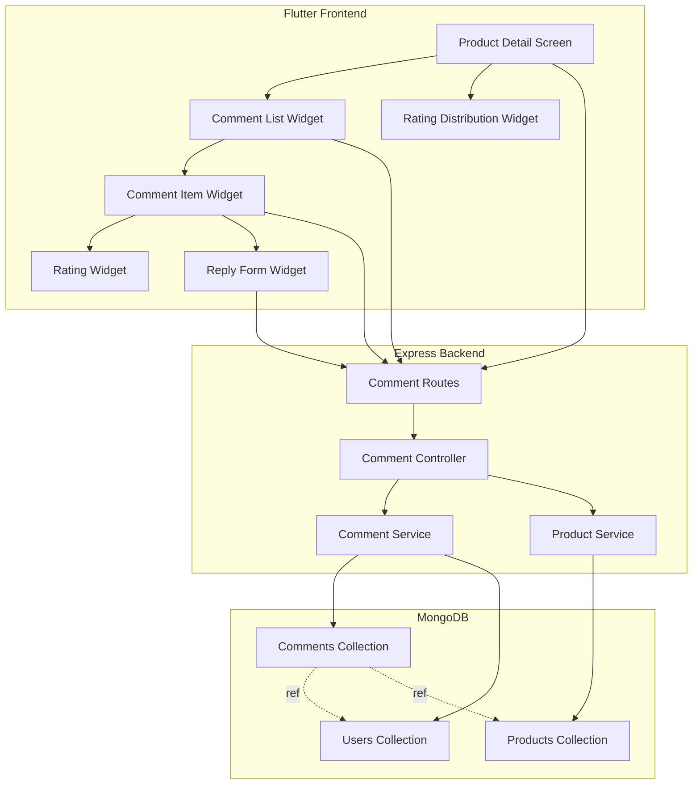
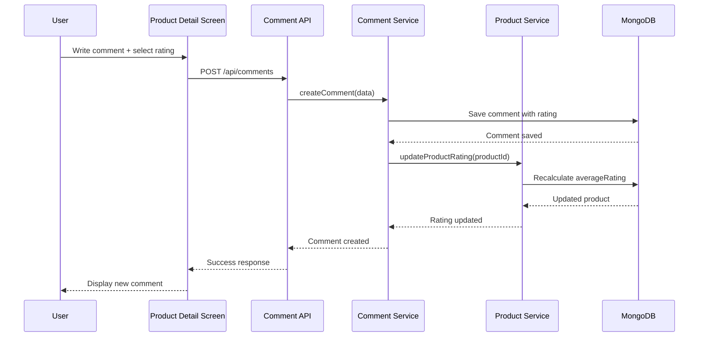
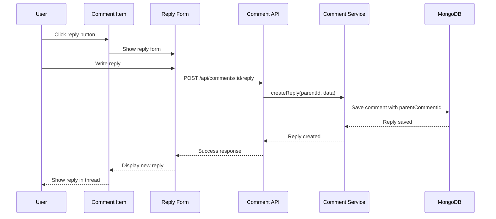
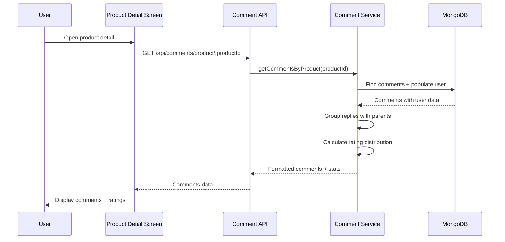

# Design Document: Product Comments & Rating

## Overview

The Product Comments & Rating feature enables users to provide feedback on products through a comprehensive rating and commenting system. Users can rate products on a 1-5 star scale, write detailed reviews, reply to other users' comments (with one level of nesting), and view aggregated rating statistics. The system displays average ratings, rating distributions, and organizes comments chronologically with the newest first. This feature enhances user engagement and provides valuable product feedback for both buyers and sellers.

The implementation leverages the existing TypeScript/Express/MongoDB backend architecture and Flutter/Dart frontend, maintaining consistency with the gold (#D4AF37) on dark theme. The system reuses existing authentication (JWT tokens) and follows established patterns from the current comment module while extending it with rating capabilities and nested reply functionality.

## Architecture




## Sequence Diagrams

### Create Comment with Rating



### Reply to Comment



### Load Comments with Ratings




## Components and Interfaces

### Backend Components

#### Comment Controller

**Purpose**: Handles HTTP requests for comment and rating operations

**Interface**:
```typescript
interface ICommentController {
  createComment(req: Request, res: Response): Promise<void>
  getCommentsByProduct(req: Request, res: Response): Promise<void>
  updateComment(req: Request, res: Response): Promise<void>
  deleteComment(req: Request, res: Response): Promise<void>
  replyToComment(req: Request, res: Response): Promise<void>
  getRatingDistribution(req: Request, res: Response): Promise<void>
}
```

**Responsibilities**:
- Validate incoming requests
- Extract user ID from JWT token
- Delegate business logic to service layer
- Return formatted API responses
- Handle error cases with appropriate status codes

#### Comment Service

**Purpose**: Implements business logic for comments and ratings

**Interface**:
```typescript
interface ICommentService {
  createComment(data: Partial<IProductComment>): Promise<IProductComment>
  getCommentsByProductId(productId: string): Promise<CommentWithReplies[]>
  updateComment(commentId: string, userId: string, data: Partial<IProductComment>): Promise<IProductComment>
  deleteComment(commentId: string, userId: string): Promise<void>
  createReply(parentId: string, data: Partial<IProductComment>): Promise<IProductComment>
  getRatingDistribution(productId: string): Promise<RatingDistribution>
  countCommentsByProduct(productId: string): Promise<number>
}
```

**Responsibilities**:
- Perform CRUD operations on comments
- Validate user ownership for updates/deletes
- Group replies with parent comments
- Calculate rating statistics
- Trigger product rating updates
- Handle nested reply logic (1 level deep)

#### Product Service Extension

**Purpose**: Manages product rating aggregation

**Interface**:
```typescript
interface IProductRatingService {
  updateProductRating(productId: string): Promise<void>
  getAverageRating(productId: string): Promise<number>
  getTotalReviews(productId: string): Promise<number>
}
```

**Responsibilities**:
- Recalculate average rating when comments change
- Update product document with new rating stats
- Maintain rating accuracy across operations

### Frontend Components

#### Product Detail Screen (Extended)

**Purpose**: Main screen displaying product information and comments section

**Interface**:
```dart
class ProductDetailScreen extends StatefulWidget {
  final String productId;
  
  @override
  _ProductDetailScreenState createState() => _ProductDetailScreenState();
}
```

**Responsibilities**:
- Display product information
- Show average rating and total reviews
- Render comment list
- Provide comment creation form
- Handle navigation and state management

#### Comment List Widget

**Purpose**: Displays all comments for a product

**Interface**:
```dart
class CommentListWidget extends StatelessWidget {
  final String productId;
  final List<Comment> comments;
  final Function(String) onReply;
  final Function(String) onDelete;
  final Function(String) onEdit;
  
  @override
  Widget build(BuildContext context);
}
```

**Responsibilities**:
- Render list of comment items
- Handle sorting (newest first)
- Manage scroll behavior
- Delegate actions to parent

#### Comment Item Widget

**Purpose**: Displays individual comment with rating and replies

**Interface**:
```dart
class CommentItemWidget extends StatelessWidget {
  final Comment comment;
  final List<Comment> replies;
  final bool isReply;
  final Function() onReply;
  final Function() onDelete;
  final Function() onEdit;
  
  @override
  Widget build(BuildContext context);
}
```

**Responsibilities**:
- Display user info, rating, comment text
- Show timestamp
- Render reply button and count
- Display nested replies (1 level)
- Handle expand/collapse for replies
- Show edit/delete options for own comments

#### Rating Widget

**Purpose**: Interactive star rating display and input

**Interface**:
```dart
class RatingWidget extends StatelessWidget {
  final double rating;
  final bool interactive;
  final Function(int)? onRatingChanged;
  final double size;
  final Color color;
  
  @override
  Widget build(BuildContext context);
}
```

**Responsibilities**:
- Display star rating (filled/half/empty)
- Handle user interaction for rating input
- Support read-only mode for display
- Use gold theme color (#D4AF37)

#### Reply Form Widget

**Purpose**: Form for replying to comments

**Interface**:
```dart
class ReplyFormWidget extends StatefulWidget {
  final String parentCommentId;
  final Function(String) onSubmit;
  final Function() onCancel;
  
  @override
  _ReplyFormWidgetState createState() => _ReplyFormWidgetState();
}
```

**Responsibilities**:
- Provide text input for reply
- Validate input
- Submit reply to API
- Handle loading states
- Show cancel option

#### Rating Distribution Widget

**Purpose**: Visual representation of rating breakdown

**Interface**:
```dart
class RatingDistributionWidget extends StatelessWidget {
  final Map<int, int> distribution;
  final int totalReviews;
  
  @override
  Widget build(BuildContext context);
}
```

**Responsibilities**:
- Display bar chart of rating distribution
- Show percentage for each star level
- Display count for each rating
- Use gold theme for bars


## Data Models

### Product Comment Model (Backend)

```typescript
interface IProductComment extends Document {
  productId: Types.ObjectId | IProduct
  userId: Types.ObjectId | IUser
  rating: number | null
  comment: string
  parentCommentId: Types.ObjectId | IProductComment | null
  createdAt: Date
  updatedAt: Date
}

const ProductCommentSchema = new mongoose.Schema<IProductComment>({
  productId: { type: Types.ObjectId, ref: "products", required: true, index: true },
  userId: { type: Types.ObjectId, ref: "users", required: true },
  rating: { type: Number, min: 1, max: 5, default: null },
  comment: { type: String, required: true, minlength: 1, maxlength: 2000 },
  parentCommentId: { type: Types.ObjectId, ref: "productComments", default: null, index: true },
  createdAt: { type: Date, default: Date.now },
  updatedAt: { type: Date, default: Date.now }
})
```

**Validation Rules**:
- `productId`: Must reference valid product
- `userId`: Must reference valid user
- `rating`: Optional for replies, required for top-level comments, range 1-5
- `comment`: Required, 1-2000 characters
- `parentCommentId`: Null for top-level comments, valid comment ID for replies
- Replies cannot have replies (enforce 1-level nesting)

**Indexes**:
- `productId`: For efficient product comment queries
- `parentCommentId`: For efficient reply lookups
- Compound index: `(productId, createdAt)` for sorted queries

### Product Model Extension (Backend)

```typescript
interface IProduct extends Document {
  name: string
  description: string
  price: number
  imageUrl: string
  category: string
  rating: number
  stock: number
  userId: Types.ObjectId | IUser
  createAt: Date
  // New fields
  averageRating: number
  totalReviews: number
  ratingDistribution: {
    1: number
    2: number
    3: number
    4: number
    5: number
  }
}
```

**New Fields**:
- `averageRating`: Calculated average of all ratings (0-5, default 0)
- `totalReviews`: Count of comments with ratings (default 0)
- `ratingDistribution`: Count of each star rating (default all 0)

**Update Strategy**:
- Recalculate on comment create/update/delete
- Use aggregation pipeline for accuracy
- Update atomically to prevent race conditions

### Comment Model (Frontend - Dart)

```dart
class Comment {
  final String id;
  final String productId;
  final User user;
  final int? rating;
  final String comment;
  final String? parentCommentId;
  final DateTime createdAt;
  final DateTime updatedAt;
  final List<Comment> replies;
  
  Comment({
    required this.id,
    required this.productId,
    required this.user,
    this.rating,
    required this.comment,
    this.parentCommentId,
    required this.createdAt,
    required this.updatedAt,
    this.replies = const [],
  });
  
  factory Comment.fromJson(Map<String, dynamic> json);
  Map<String, dynamic> toJson();
  
  bool get isReply => parentCommentId != null;
  bool get hasRating => rating != null;
}
```

### Rating Distribution Model (Frontend - Dart)

```dart
class RatingDistribution {
  final Map<int, int> distribution;
  final int totalReviews;
  final double averageRating;
  
  RatingDistribution({
    required this.distribution,
    required this.totalReviews,
    required this.averageRating,
  });
  
  factory RatingDistribution.fromJson(Map<String, dynamic> json);
  
  int getCount(int stars) => distribution[stars] ?? 0;
  double getPercentage(int stars) {
    if (totalReviews == 0) return 0.0;
    return (getCount(stars) / totalReviews) * 100;
  }
}
```

### API Request/Response Models

#### Create Comment Request

```typescript
interface CreateCommentRequest {
  productId: string
  rating: number  // 1-5
  comment: string
}
```

#### Create Reply Request

```typescript
interface CreateReplyRequest {
  comment: string
  // rating not allowed for replies
}
```

#### Update Comment Request

```typescript
interface UpdateCommentRequest {
  rating?: number  // 1-5
  comment?: string
}
```

#### Comment Response

```typescript
interface CommentResponse {
  _id: string
  productId: string
  userId: {
    _id: string
    username: string
    avatar?: string
  }
  rating: number | null
  comment: string
  parentCommentId: string | null
  createdAt: string
  updatedAt: string
  replies?: CommentResponse[]
}
```

#### Comments List Response

```typescript
interface CommentsListResponse {
  comments: CommentResponse[]
  ratingDistribution: {
    1: number
    2: number
    3: number
    4: number
    5: number
  }
  averageRating: number
  totalReviews: number
}
```


## API Design

### Endpoints

#### POST /api/comments

Create a new comment with rating for a product.

**Authentication**: Required (JWT)

**Request Body**:
```json
{
  "productId": "507f1f77bcf86cd799439011",
  "rating": 5,
  "comment": "Excellent product! Highly recommended."
}
```

**Response** (201 Created):
```json
{
  "status": "success",
  "message": "Comment created successfully",
  "data": {
    "_id": "507f1f77bcf86cd799439012",
    "productId": "507f1f77bcf86cd799439011",
    "userId": {
      "_id": "507f1f77bcf86cd799439013",
      "username": "john_doe",
      "avatar": "https://example.com/avatar.jpg"
    },
    "rating": 5,
    "comment": "Excellent product! Highly recommended.",
    "parentCommentId": null,
    "createdAt": "2024-01-15T10:30:00.000Z",
    "updatedAt": "2024-01-15T10:30:00.000Z"
  }
}
```

**Error Responses**:
- 400: Invalid rating (not 1-5) or missing required fields
- 401: Unauthorized (no token or invalid token)
- 404: Product not found
- 500: Server error

---

#### GET /api/comments/product/:productId

Get all comments and replies for a product with rating statistics.

**Authentication**: Optional (public endpoint)

**Query Parameters**:
- `sort`: "newest" (default) | "oldest" | "highest_rated" | "lowest_rated"
- `limit`: Number of comments per page (default: 20)
- `page`: Page number (default: 1)

**Response** (200 OK):
```json
{
  "status": "success",
  "message": "Comments fetched successfully",
  "data": {
    "comments": [
      {
        "_id": "507f1f77bcf86cd799439012",
        "productId": "507f1f77bcf86cd799439011",
        "userId": {
          "_id": "507f1f77bcf86cd799439013",
          "username": "john_doe",
          "avatar": "https://example.com/avatar.jpg"
        },
        "rating": 5,
        "comment": "Excellent product!",
        "parentCommentId": null,
        "createdAt": "2024-01-15T10:30:00.000Z",
        "updatedAt": "2024-01-15T10:30:00.000Z",
        "replies": [
          {
            "_id": "507f1f77bcf86cd799439014",
            "productId": "507f1f77bcf86cd799439011",
            "userId": {
              "_id": "507f1f77bcf86cd799439015",
              "username": "jane_smith"
            },
            "rating": null,
            "comment": "I agree! Great quality.",
            "parentCommentId": "507f1f77bcf86cd799439012",
            "createdAt": "2024-01-15T11:00:00.000Z",
            "updatedAt": "2024-01-15T11:00:00.000Z"
          }
        ]
      }
    ],
    "ratingDistribution": {
      "1": 2,
      "2": 5,
      "3": 10,
      "4": 25,
      "5": 58
    },
    "averageRating": 4.32,
    "totalReviews": 100,
    "pagination": {
      "currentPage": 1,
      "totalPages": 5,
      "totalComments": 100,
      "hasMore": true
    }
  }
}
```

**Error Responses**:
- 404: Product not found
- 500: Server error

---

#### PUT /api/comments/:id

Update an existing comment (user can only update their own comments).

**Authentication**: Required (JWT)

**Request Body**:
```json
{
  "rating": 4,
  "comment": "Updated: Good product with minor issues."
}
```

**Response** (200 OK):
```json
{
  "status": "success",
  "message": "Comment updated successfully",
  "data": {
    "_id": "507f1f77bcf86cd799439012",
    "productId": "507f1f77bcf86cd799439011",
    "userId": "507f1f77bcf86cd799439013",
    "rating": 4,
    "comment": "Updated: Good product with minor issues.",
    "parentCommentId": null,
    "createdAt": "2024-01-15T10:30:00.000Z",
    "updatedAt": "2024-01-15T12:00:00.000Z"
  }
}
```

**Error Responses**:
- 400: Invalid data
- 401: Unauthorized
- 403: Forbidden (not comment owner)
- 404: Comment not found
- 500: Server error

---

#### DELETE /api/comments/:id

Delete a comment (user can only delete their own comments). Deleting a parent comment also deletes all replies.

**Authentication**: Required (JWT)

**Response** (200 OK):
```json
{
  "status": "success",
  "message": "Comment deleted successfully",
  "data": {
    "deletedCount": 3
  }
}
```

**Error Responses**:
- 401: Unauthorized
- 403: Forbidden (not comment owner)
- 404: Comment not found
- 500: Server error

---

#### POST /api/comments/:id/reply

Reply to an existing comment (1 level nesting only).

**Authentication**: Required (JWT)

**Request Body**:
```json
{
  "comment": "I agree with your review!"
}
```

**Response** (201 Created):
```json
{
  "status": "success",
  "message": "Reply created successfully",
  "data": {
    "_id": "507f1f77bcf86cd799439014",
    "productId": "507f1f77bcf86cd799439011",
    "userId": {
      "_id": "507f1f77bcf86cd799439015",
      "username": "jane_smith"
    },
    "rating": null,
    "comment": "I agree with your review!",
    "parentCommentId": "507f1f77bcf86cd799439012",
    "createdAt": "2024-01-15T11:00:00.000Z",
    "updatedAt": "2024-01-15T11:00:00.000Z"
  }
}
```

**Error Responses**:
- 400: Invalid data or attempting to reply to a reply (nesting too deep)
- 401: Unauthorized
- 404: Parent comment not found
- 500: Server error

---

#### GET /api/comments/product/:productId/distribution

Get rating distribution statistics for a product.

**Authentication**: Optional (public endpoint)

**Response** (200 OK):
```json
{
  "status": "success",
  "message": "Rating distribution fetched successfully",
  "data": {
    "distribution": {
      "1": 2,
      "2": 5,
      "3": 10,
      "4": 25,
      "5": 58
    },
    "averageRating": 4.32,
    "totalReviews": 100
  }
}
```

**Error Responses**:
- 404: Product not found
- 500: Server error


## Error Handling

### Error Scenario 1: Invalid Rating Value

**Condition**: User submits rating outside 1-5 range or non-integer value

**Response**: 
- Backend returns 400 Bad Request
- Error message: "Rating must be an integer between 1 and 5"
- Frontend displays validation error below rating widget

**Recovery**: 
- User corrects rating value
- Form validation prevents submission until valid

### Error Scenario 2: Unauthorized Comment Modification

**Condition**: User attempts to edit/delete another user's comment

**Response**:
- Backend verifies userId from JWT matches comment owner
- Returns 403 Forbidden if mismatch
- Error message: "You can only modify your own comments"

**Recovery**:
- Frontend hides edit/delete buttons for comments not owned by current user
- If API call fails, display error toast and refresh comment list

### Error Scenario 3: Nested Reply Too Deep

**Condition**: User attempts to reply to a reply (exceeding 1-level nesting)

**Response**:
- Backend checks if parentCommentId has a non-null parentCommentId
- Returns 400 Bad Request
- Error message: "Cannot reply to a reply. Please reply to the original comment."

**Recovery**:
- Frontend disables reply button on reply comments
- If user somehow triggers it, show error message and suggest replying to parent

### Error Scenario 4: Product Not Found

**Condition**: Comment submitted for non-existent product

**Response**:
- Backend validates productId exists before creating comment
- Returns 404 Not Found
- Error message: "Product not found"

**Recovery**:
- Frontend navigates user back to product list
- Display error notification

### Error Scenario 5: Comment Too Long

**Condition**: Comment exceeds 2000 character limit

**Response**:
- Frontend validates length before submission
- Backend validates and returns 400 if exceeded
- Error message: "Comment must be 2000 characters or less"

**Recovery**:
- Show character counter in comment form
- Disable submit button when limit exceeded
- Display remaining characters

### Error Scenario 6: Concurrent Rating Updates

**Condition**: Multiple users rate product simultaneously

**Response**:
- Use MongoDB atomic operations for rating updates
- Implement optimistic locking with version field if needed
- Recalculate from source of truth (aggregation) rather than incremental updates

**Recovery**:
- System automatically resolves conflicts
- No user action required
- Rating displayed may have slight delay but will be eventually consistent

### Error Scenario 7: Network Failure During Submission

**Condition**: Network drops while submitting comment

**Response**:
- Frontend detects network error
- Display error message: "Network error. Please check your connection."
- Comment not saved

**Recovery**:
- Preserve comment text in form
- Show retry button
- User can resubmit when connection restored

### Error Scenario 8: Deleted Parent Comment

**Condition**: User views replies to a comment that gets deleted

**Response**:
- Backend cascade deletes all replies when parent deleted
- Frontend receives updated comment list
- Replies automatically removed from UI

**Recovery**:
- Refresh comment list after delete operation
- Show notification: "Comment and X replies deleted"


## Testing Strategy

### Unit Testing Approach

**Backend Unit Tests**:

Test the Comment Service layer in isolation with mocked database:

1. **Comment Creation Tests**:
   - Create comment with valid rating (1-5)
   - Reject comment with invalid rating (0, 6, -1)
   - Reject comment without required fields
   - Verify userId extracted from JWT correctly
   - Verify timestamps set correctly

2. **Comment Retrieval Tests**:
   - Fetch comments by productId
   - Verify comments sorted by createdAt descending
   - Verify replies grouped with parent comments
   - Verify user data populated correctly
   - Handle empty comment list

3. **Comment Update Tests**:
   - Update own comment successfully
   - Reject update from non-owner
   - Update rating only
   - Update comment text only
   - Update both rating and text
   - Verify updatedAt timestamp changes

4. **Comment Delete Tests**:
   - Delete own comment successfully
   - Reject delete from non-owner
   - Cascade delete replies when parent deleted
   - Verify deletedCount returned correctly

5. **Reply Creation Tests**:
   - Create reply to top-level comment
   - Reject reply to reply (nesting too deep)
   - Verify rating not allowed on replies
   - Verify parentCommentId set correctly

6. **Rating Calculation Tests**:
   - Calculate average rating correctly
   - Calculate rating distribution
   - Handle zero reviews case
   - Update product rating after comment create
   - Update product rating after comment update
   - Update product rating after comment delete

**Frontend Unit Tests**:

Test widgets in isolation with mocked API:

1. **Rating Widget Tests**:
   - Display correct number of filled stars
   - Display half stars for decimal ratings
   - Handle user tap on stars (interactive mode)
   - Disable interaction in read-only mode
   - Use gold theme color

2. **Comment Item Widget Tests**:
   - Display user info correctly
   - Display rating stars
   - Display comment text
   - Show/hide edit/delete buttons based on ownership
   - Display reply count
   - Expand/collapse replies

3. **Comment List Widget Tests**:
   - Render list of comments
   - Sort by newest first
   - Handle empty state
   - Handle loading state
   - Handle error state

4. **Reply Form Widget Tests**:
   - Accept text input
   - Validate minimum length
   - Validate maximum length (2000 chars)
   - Show character counter
   - Submit reply on button press
   - Show loading indicator during submission
   - Clear form after successful submission

5. **Rating Distribution Widget Tests**:
   - Display bars for each rating level
   - Calculate percentages correctly
   - Display counts correctly
   - Handle zero reviews case
   - Use gold theme for bars

**Test Coverage Goals**:
- Backend: 80% code coverage minimum
- Frontend: 70% widget coverage minimum
- All critical paths (create, update, delete) must be tested

### Property-Based Testing Approach

**Property Test Library**: fast-check (TypeScript/JavaScript)

**Properties to Test**:

1. **Rating Bounds Property**:
   - For any comment with a rating, rating must be between 1 and 5 inclusive
   - Generate random comments and verify rating constraint

2. **Average Rating Property**:
   - Average rating must always be between 0 and 5
   - Average of N ratings equals sum of ratings divided by N
   - Generate random sets of ratings and verify calculation

3. **Nesting Depth Property**:
   - For any comment, if parentCommentId is not null, the parent must have null parentCommentId
   - No comment can have nesting depth > 1
   - Generate random comment trees and verify depth constraint

4. **Cascade Delete Property**:
   - Deleting a parent comment must delete all its replies
   - Count of deleted comments = 1 + count of replies
   - Generate random comment trees and verify cascade behavior

5. **Rating Distribution Property**:
   - Sum of all distribution counts must equal totalReviews
   - Each distribution count must be non-negative
   - Generate random rating sets and verify distribution calculation

6. **Idempotency Property**:
   - Fetching comments multiple times returns same results (if no changes)
   - Deleting already-deleted comment returns appropriate error
   - Generate random operations and verify idempotency

7. **Timestamp Ordering Property**:
   - Comments sorted by createdAt descending must have timestamps in decreasing order
   - updatedAt must be >= createdAt for all comments
   - Generate random timestamps and verify ordering

### Integration Testing Approach

**Backend Integration Tests**:

Test full request/response cycle with test database:

1. **End-to-End Comment Flow**:
   - Create user and product
   - Create comment with rating
   - Verify product rating updated
   - Fetch comments and verify returned
   - Update comment and verify changes
   - Delete comment and verify removal
   - Verify product rating recalculated

2. **Reply Flow**:
   - Create parent comment
   - Create reply to parent
   - Verify reply appears in parent's replies array
   - Attempt to reply to reply (should fail)
   - Delete parent and verify reply also deleted

3. **Authentication Flow**:
   - Create comment without token (should fail)
   - Create comment with invalid token (should fail)
   - Create comment with valid token (should succeed)
   - Update another user's comment (should fail)
   - Delete another user's comment (should fail)

4. **Pagination Flow**:
   - Create 50 comments
   - Fetch page 1 with limit 20
   - Verify 20 comments returned
   - Verify pagination metadata correct
   - Fetch page 2 and verify different comments

**Frontend Integration Tests**:

Test widget interactions with real API calls (using test backend):

1. **Product Detail Screen Flow**:
   - Load product detail screen
   - Verify comments loaded and displayed
   - Verify rating distribution displayed
   - Create new comment
   - Verify comment appears in list
   - Verify rating updated

2. **Reply Interaction Flow**:
   - Click reply button on comment
   - Verify reply form appears
   - Submit reply
   - Verify reply appears under parent
   - Verify reply count incremented

3. **Edit/Delete Flow**:
   - Create comment as user A
   - Login as user B
   - Verify edit/delete buttons hidden
   - Login as user A
   - Verify edit/delete buttons visible
   - Edit comment and verify changes
   - Delete comment and verify removal

**Test Environment**:
- Use separate test database
- Reset database between test suites
- Use test JWT tokens with known user IDs
- Mock external dependencies (email, notifications)


## Performance Considerations

### Database Optimization

**Indexing Strategy**:
- Create compound index on `(productId, createdAt)` for efficient sorted queries
- Create index on `parentCommentId` for fast reply lookups
- Create index on `userId` for user-specific queries
- Monitor index usage and adjust based on query patterns

**Query Optimization**:
- Use aggregation pipeline for rating calculations instead of multiple queries
- Implement pagination to limit result set size (default 20 comments per page)
- Use `lean()` queries when full Mongoose documents not needed
- Populate user data selectively (only username and avatar, not full user object)

**Caching Strategy**:
- Cache rating distribution for products with Redis (TTL: 5 minutes)
- Invalidate cache on comment create/update/delete
- Cache comment counts per product
- Consider caching frequently accessed product comments

### Frontend Optimization

**Lazy Loading**:
- Implement infinite scroll for comment list
- Load replies on-demand when user expands parent comment
- Paginate comments (load 20 at a time)
- Show loading skeleton while fetching

**State Management**:
- Use local state for UI interactions (expand/collapse)
- Use provider/bloc for comment data management
- Implement optimistic updates for better UX
- Debounce search/filter operations

**Widget Optimization**:
- Use `const` constructors where possible
- Implement `ListView.builder` for efficient list rendering
- Avoid rebuilding entire comment list on single comment update
- Use `RepaintBoundary` for complex comment items

### API Performance

**Response Time Targets**:
- GET comments: < 200ms for 20 comments
- POST comment: < 150ms
- PUT comment: < 100ms
- DELETE comment: < 100ms
- GET rating distribution: < 50ms (with caching)

**Rate Limiting**:
- Implement rate limiting on comment creation (max 10 per minute per user)
- Prevent spam and abuse
- Return 429 Too Many Requests when limit exceeded

**Payload Optimization**:
- Minimize response payload size
- Only return necessary user fields (username, avatar)
- Use projection to exclude unnecessary fields
- Compress responses with gzip

### Scalability Considerations

**Horizontal Scaling**:
- Design stateless API for easy horizontal scaling
- Use MongoDB replica sets for read scaling
- Implement connection pooling for database connections

**Data Growth Management**:
- Archive old comments after 2 years (optional)
- Implement soft delete for audit trail
- Monitor collection size and plan for sharding if needed

**Concurrent Operations**:
- Use atomic operations for rating updates
- Implement optimistic locking for comment updates if needed
- Handle race conditions in rating calculations


## Security Considerations

### Authentication & Authorization

**JWT Token Validation**:
- Verify JWT signature on all protected endpoints
- Extract userId from token for ownership checks
- Reject expired or malformed tokens
- Use middleware for consistent token validation

**Ownership Verification**:
- Users can only edit/delete their own comments
- Verify comment.userId matches authenticated user ID
- Return 403 Forbidden for unauthorized modifications
- Admin role can moderate any comment (future enhancement)

**API Endpoint Protection**:
- POST /api/comments: Requires authentication
- PUT /api/comments/:id: Requires authentication + ownership
- DELETE /api/comments/:id: Requires authentication + ownership
- POST /api/comments/:id/reply: Requires authentication
- GET endpoints: Public (no authentication required)

### Input Validation & Sanitization

**Comment Text Validation**:
- Sanitize HTML/script tags to prevent XSS attacks
- Limit comment length to 2000 characters
- Trim whitespace
- Reject empty comments
- Use validation middleware on all input

**Rating Validation**:
- Ensure rating is integer between 1-5
- Reject non-numeric values
- Reject ratings on replies
- Validate on both frontend and backend

**ID Validation**:
- Validate MongoDB ObjectId format
- Prevent NoSQL injection through ID parameters
- Use Mongoose schema validation
- Sanitize all user inputs

### Rate Limiting & Abuse Prevention

**Comment Creation Limits**:
- Max 10 comments per user per minute
- Max 50 comments per user per hour
- Track by user ID from JWT token
- Return 429 Too Many Requests when exceeded

**Reply Limits**:
- Max 20 replies per user per minute
- Prevent reply spam on single comment
- Track by user ID and parent comment ID

**IP-Based Rate Limiting**:
- Implement IP-based rate limiting for public endpoints
- Prevent anonymous abuse
- Use Redis for distributed rate limiting

### Data Privacy

**User Data Exposure**:
- Only expose necessary user fields (username, avatar)
- Never expose email, password, or sensitive data in comment responses
- Use projection to limit fields returned
- Implement field-level access control

**Comment Deletion**:
- Implement soft delete for audit trail
- Mark as deleted but retain in database
- Option for hard delete after grace period
- Cascade delete replies when parent deleted

**GDPR Compliance**:
- Allow users to request comment data export
- Allow users to request comment deletion
- Anonymize user data on account deletion
- Retain minimal data for legal compliance

### Content Moderation

**Profanity Filtering** (Future Enhancement):
- Implement profanity filter on comment submission
- Flag comments for manual review
- Auto-reject comments with severe violations
- Maintain blacklist of prohibited terms

**Spam Detection** (Future Enhancement):
- Detect duplicate comments
- Identify suspicious patterns (repeated text, links)
- Flag for manual review
- Implement CAPTCHA for suspicious activity

**Reporting System** (Future Enhancement):
- Allow users to report inappropriate comments
- Queue reported comments for moderator review
- Track report history per user
- Implement automated actions for repeat offenders

### Database Security

**Connection Security**:
- Use encrypted MongoDB connections (TLS/SSL)
- Store connection strings in environment variables
- Rotate database credentials regularly
- Limit database user permissions

**Query Security**:
- Use parameterized queries (Mongoose handles this)
- Prevent NoSQL injection
- Validate all query parameters
- Implement query timeouts

**Backup & Recovery**:
- Regular automated backups
- Test restore procedures
- Encrypt backups at rest
- Maintain backup retention policy


## Dependencies

### Backend Dependencies

**Core Dependencies**:
- `express` (^4.18.0): Web framework for API endpoints
- `mongoose` (^7.0.0): MongoDB ODM for data modeling
- `jsonwebtoken` (^9.0.0): JWT token generation and verification
- `express-validator` (^7.0.0): Request validation middleware

**Development Dependencies**:
- `typescript` (^5.0.0): TypeScript compiler
- `@types/express` (^4.17.0): TypeScript types for Express
- `@types/node` (^20.0.0): TypeScript types for Node.js
- `jest` (^29.0.0): Testing framework
- `supertest` (^6.3.0): HTTP assertion library for integration tests
- `ts-jest` (^29.0.0): Jest transformer for TypeScript
- `mongodb-memory-server` (^9.0.0): In-memory MongoDB for testing

**Optional Dependencies**:
- `redis` (^4.6.0): Caching layer for rating distribution
- `express-rate-limit` (^6.10.0): Rate limiting middleware
- `helmet` (^7.0.0): Security headers middleware
- `cors` (^2.8.5): CORS middleware
- `dotenv` (^16.0.0): Environment variable management

### Frontend Dependencies

**Core Dependencies**:
- `flutter` (SDK): Flutter framework
- `http` (^1.1.0): HTTP client for API calls
- `provider` (^6.0.0): State management solution
- `shared_preferences` (^2.2.0): Local storage for tokens

**UI Dependencies**:
- `flutter_rating_bar` (^4.0.1): Star rating widget
- `intl` (^0.18.0): Date formatting and internationalization
- `cached_network_image` (^3.3.0): Image caching for user avatars
- `shimmer` (^3.0.0): Loading skeleton animations

**Development Dependencies**:
- `flutter_test` (SDK): Flutter testing framework
- `mockito` (^5.4.0): Mocking library for tests
- `build_runner` (^2.4.0): Code generation for mocks
- `flutter_lints` (^3.0.0): Linting rules

### External Services

**Required Services**:
- MongoDB (^6.0): Primary database
- Node.js (^18.0): Runtime environment

**Optional Services**:
- Redis (^7.0): Caching layer for performance optimization
- AWS S3 / CloudFront: CDN for user avatars (if not using existing solution)

### Existing System Dependencies

**Backend Modules** (Already Implemented):
- `src/modules/comments/`: Base comment module (will be extended)
- `src/modules/products/`: Product module (will be extended with rating fields)
- `src/modules/users/`: User module (for user data population)
- `src/middlewares/authMiddleware.ts`: JWT authentication
- `src/config/db.ts`: Database connection
- `src/interfaces/wrapper/ApiResponseWrapper.ts`: Standardized API responses

**Frontend Modules** (Already Implemented):
- `lib/api/`: API client utilities
- `lib/config/app_config.dart`: App configuration
- `lib/services/`: Service layer for API calls
- Theme configuration with gold (#D4AF37) color

### Version Compatibility

**Node.js**: >= 18.0.0 (LTS)
**MongoDB**: >= 6.0.0
**Flutter**: >= 3.10.0
**Dart**: >= 3.0.0

### Migration Requirements

**Database Migration**:
- Add new fields to Product model (averageRating, totalReviews, ratingDistribution)
- Create new ProductComment collection with indexes
- Migrate existing comments if applicable (from artwork comments to product comments)

**API Migration**:
- Extend existing comment routes with new endpoints
- Maintain backward compatibility if needed
- Version API if breaking changes required


## Implementation Notes

### Backend Implementation Strategy

**Phase 1: Data Layer**
1. Create ProductComment model with schema and validation
2. Add indexes for performance (productId, parentCommentId, compound indexes)
3. Extend Product model with rating fields
4. Create database migration script

**Phase 2: Service Layer**
1. Implement CommentService methods (CRUD operations)
2. Implement rating calculation logic
3. Implement reply nesting validation
4. Add product rating update triggers

**Phase 3: Controller & Routes**
1. Create comment controller methods
2. Add request validation middleware
3. Implement authentication checks
4. Define API routes
5. Add rate limiting middleware

**Phase 4: Testing**
1. Write unit tests for service layer
2. Write integration tests for API endpoints
3. Test rating calculation accuracy
4. Test cascade delete behavior

### Frontend Implementation Strategy

**Phase 1: Data Layer**
1. Create Comment model class
2. Create RatingDistribution model class
3. Implement JSON serialization/deserialization
4. Create API client methods

**Phase 2: UI Components**
1. Build RatingWidget (display and input modes)
2. Build CommentItemWidget
3. Build ReplyFormWidget
4. Build RatingDistributionWidget
5. Build CommentListWidget

**Phase 3: Screen Integration**
1. Extend ProductDetailScreen with comments section
2. Implement state management for comments
3. Add comment creation form
4. Implement reply functionality
5. Add edit/delete actions

**Phase 4: Testing**
1. Write widget tests for all components
2. Write integration tests for user flows
3. Test error handling and edge cases
4. Test UI responsiveness

### Key Design Decisions

**1. One-Level Nesting Only**
- Rationale: Simplifies UI and prevents deeply nested threads
- Implementation: Validate parentCommentId has null parent
- Alternative considered: Unlimited nesting (rejected for complexity)

**2. Rating on Top-Level Comments Only**
- Rationale: Ratings represent product reviews, not reply quality
- Implementation: Rating field null for replies, required for top-level
- Alternative considered: Allow rating on replies (rejected for clarity)

**3. Cascade Delete Replies**
- Rationale: Orphaned replies lose context without parent
- Implementation: Delete all replies when parent deleted
- Alternative considered: Keep replies as top-level (rejected for UX)

**4. Recalculate vs Incremental Rating Updates**
- Rationale: Aggregation ensures accuracy despite complexity
- Implementation: Use MongoDB aggregation pipeline on each change
- Alternative considered: Incremental updates (rejected for accuracy concerns)

**5. Public Comment Viewing**
- Rationale: Product reviews should be visible to all users
- Implementation: GET endpoints don't require authentication
- Alternative considered: Require login to view (rejected for accessibility)

**6. Newest First Sorting**
- Rationale: Recent reviews more relevant for purchase decisions
- Implementation: Sort by createdAt descending by default
- Alternative considered: Highest rated first (available as option)

### Future Enhancements

**Phase 2 Features** (Not in Initial Release):
- Comment reactions (helpful/not helpful)
- Image attachments in comments
- Verified purchase badge
- Sort by most helpful
- Filter by rating (show only 5-star reviews)

**Phase 3 Features**:
- Comment search functionality
- Seller responses to reviews
- Review voting system
- Comment moderation dashboard
- Automated spam detection

**Phase 4 Features**:
- AI-powered review summaries
- Sentiment analysis
- Review quality scoring
- Personalized review recommendations


## Correctness Properties

*A property is a characteristic or behavior that should hold true across all valid executions of a system—essentially, a formal statement about what the system should do. Properties serve as the bridge between human-readable specifications and machine-verifiable correctness guarantees.*

### Property 1: Valid Rating Bounds

*For any* comment with a rating value, the rating must be an integer between 1 and 5 inclusive.

**Validates: Requirements 1.3, 5.4, 10.2**

### Property 2: Comment Text Length Validation

*For any* comment or reply submission, the text must be between 1 and 2000 characters after trimming whitespace, and empty or whitespace-only strings must be rejected.

**Validates: Requirements 1.4, 4.5, 5.5, 10.3, 10.4**

### Property 3: User Association Correctness

*For any* created comment or reply, the userId field must match the authenticated user's ID extracted from the JWT token.

**Validates: Requirements 1.2**

### Property 4: Timestamp Initialization

*For any* newly created comment, the createdAt and updatedAt timestamps must be set to the same value at creation time.

**Validates: Requirements 1.6**

### Property 5: Timestamp Ordering Invariant

*For any* comment at any time, the updatedAt timestamp must be greater than or equal to the createdAt timestamp.

**Validates: Requirements 15.6**

### Property 6: Update Timestamp Modification

*For any* comment update operation, the updatedAt timestamp must change to a value greater than the previous updatedAt value.

**Validates: Requirements 5.6**

### Property 7: Average Rating Bounds Invariant

*For any* product at any time, the averageRating field must be between 0 and 5 inclusive.

**Validates: Requirements 2.7, 15.7**

### Property 8: Rating Distribution Consistency

*For any* product, the sum of all rating distribution counts (1-star through 5-star) must equal the totalReviews count.

**Validates: Requirements 2.5, 2.6, 15.3**

### Property 9: Rating Recalculation on Create

*For any* product, when a new comment with rating is created, the product's averageRating and ratingDistribution must be recalculated to reflect the new rating.

**Validates: Requirements 2.1**

### Property 10: Rating Recalculation on Update

*For any* product, when a comment's rating is updated, the product's averageRating and ratingDistribution must be recalculated to reflect the changed rating.

**Validates: Requirements 2.2**

### Property 11: Rating Recalculation on Delete

*For any* product, when a comment with rating is deleted, the product's averageRating and ratingDistribution must be recalculated to exclude the deleted rating.

**Validates: Requirements 2.3, 6.6**

### Property 12: Reply Nesting Depth Constraint

*For any* comment, if parentCommentId is not null, then the parent comment must have a null parentCommentId (enforcing maximum 1-level nesting).

**Validates: Requirements 4.2, 4.3**

### Property 13: Reply Rating Prohibition

*For any* reply (comment with non-null parentCommentId), the rating field must be null, and attempts to create replies with ratings must be rejected.

**Validates: Requirements 4.4**

### Property 14: Cascade Delete Completeness

*For any* top-level comment deletion, all replies (comments with parentCommentId matching the deleted comment's ID) must also be deleted.

**Validates: Requirements 6.3**

### Property 15: Delete Count Accuracy

*For any* comment deletion operation, the returned deletedCount must equal 1 plus the number of replies to that comment.

**Validates: Requirements 6.4**

### Property 16: Comment Sort Order

*For any* comment list query with default or "newest" sorting, the returned comments must be ordered by createdAt timestamp in descending order (newest first).

**Validates: Requirements 3.1**

### Property 17: Reply Grouping Completeness

*For any* comment list response, all replies must be nested under their parent comments, and no reply should appear as a top-level comment.

**Validates: Requirements 3.2, 4.6**

### Property 18: User Data Population

*For any* comment in a response, the userId field must be populated with at least the username and avatar fields from the user document.

**Validates: Requirements 1.5, 3.3**

### Property 19: Response Completeness for Comment Queries

*For any* product comment query response, the response must include comments array, ratingDistribution object, averageRating value, and totalReviews count.

**Validates: Requirements 3.4, 3.5, 7.3, 7.4**

### Property 20: Pagination Subset Correctness

*For any* paginated comment query with page number P and limit L, the response must contain at most L comments starting from offset (P-1) × L in the sorted result set.

**Validates: Requirements 3.6**

### Property 21: Sort Option Correctness

*For any* comment query with a specified sort option (newest, oldest, highest_rated, lowest_rated), the returned comments must be ordered according to the specified criterion.

**Validates: Requirements 3.7**

### Property 22: Rating Distribution Excludes Replies

*For any* product's rating distribution calculation, only top-level comments with non-null ratings must be counted, and replies must be excluded.

**Validates: Requirements 7.2**

### Property 23: Ownership Verification for Updates

*For any* comment update attempt, the operation must succeed only if the authenticated user's ID matches the comment's userId, otherwise returning a 403 Forbidden error.

**Validates: Requirements 5.1, 5.7**

### Property 24: Ownership Verification for Deletes

*For any* comment delete attempt, the operation must succeed only if the authenticated user's ID matches the comment's userId, otherwise returning a 403 Forbidden error.

**Validates: Requirements 6.1, 6.5**

### Property 25: Authentication Requirement for Mutations

*For any* comment creation, update, deletion, or reply operation, the request must include a valid JWT token, otherwise returning a 401 Unauthorized error.

**Validates: Requirements 9.1, 9.2, 9.3, 9.4**

### Property 26: XSS Prevention through Sanitization

*For any* comment text submission containing HTML or script tags, the stored comment text must have those tags sanitized or escaped to prevent XSS attacks.

**Validates: Requirements 10.1**

### Property 27: ObjectId Format Validation

*For any* operation accepting productId or commentId parameters, the system must validate they are valid MongoDB ObjectId format strings, rejecting invalid formats with a 400 Bad Request error.

**Validates: Requirements 10.5, 10.6**

### Property 28: Validation Error Response Format

*For any* validation failure, the system must return a 400 Bad Request status code with a descriptive error message explaining the validation failure.

**Validates: Requirements 10.7**

### Property 29: HTTP Status Code Consistency

*For any* error response, the HTTP status code must match the error type: 400 for validation errors, 401 for authentication failures, 403 for authorization failures, 404 for not found, 429 for rate limit exceeded, and 500 for server errors.

**Validates: Requirements 14.7**

### Property 30: Product Existence Validation

*For any* comment creation attempt, the system must verify the referenced product exists before saving the comment, returning a 404 error if the product is not found.

**Validates: Requirements 15.4**

### Property 31: Parent Comment Existence Validation

*For any* reply creation attempt, the system must verify the parent comment exists before saving the reply, returning a 404 error if the parent is not found.

**Validates: Requirements 15.5**

### Property 32: Pagination Metadata Completeness

*For any* paginated comment query response, the pagination metadata must include currentPage, totalPages, totalComments, and hasMore fields.

**Validates: Requirements 17.5**

### Property 33: User Data Field Projection

*For any* comment response with populated user data, only the username and avatar fields must be included from the user document, not the entire user object.

**Validates: Requirements 19.5**

### Property 34: Character Count Calculation

*For any* comment text input, the remaining character count must equal 2000 minus the current text length.

**Validates: Requirements 18.2**

### Property 35: Rating Widget Display Accuracy

*For any* rating value R between 0 and 5, the rating widget must display floor(R) filled stars, and if R has a fractional part >= 0.5, one additional half-filled star.

**Validates: Requirements 8.4, 8.5**

### Property 36: Comment Item Display Completeness

*For any* rendered comment item, the display must include the user's username, avatar (if present), comment text, and creation timestamp.

**Validates: Requirements 13.1, 13.3, 13.4**

### Property 37: Reply Count Accuracy

*For any* top-level comment with replies, the displayed reply count must equal the actual number of replies (comments with parentCommentId matching the parent's ID).

**Validates: Requirements 13.5**

### Property 38: Ownership-Based Action Visibility

*For any* comment displayed to an authenticated user, edit and delete action buttons must be visible only if the comment's userId matches the authenticated user's ID.

**Validates: Requirements 13.7**

