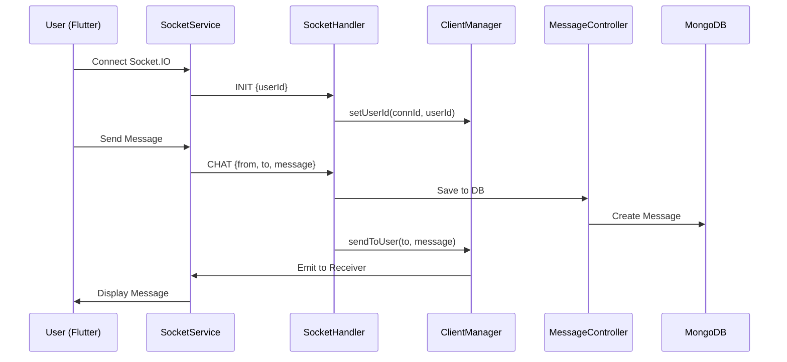
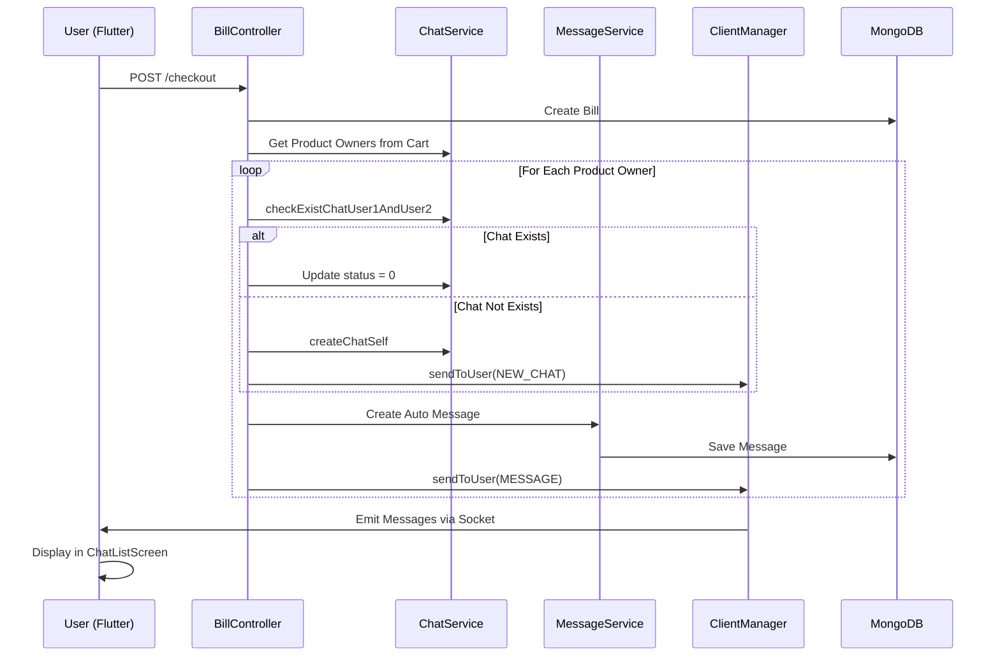

# Design Document: Realtime Chat with Auto Thank You

## Overview

Chức năng chat realtime cho phép người dùng giao tiếp trực tiếp với nhau thông qua Socket.IO, kết hợp với tính năng tự động gửi tin nhắn cảm ơn từ người bán cho khách hàng sau khi checkout thành công. Hệ thống tận dụng infrastructure Socket.IO hiện có (socketHandler.ts, clientManager.ts) và các models đã có (Chat, Message, Bill) để xây dựng trải nghiệm chat realtime với UI theo gold/dark theme của ứng dụng.

Hệ thống bao gồm hai luồng chính: (1) Chat realtime giữa users với danh sách conversations, chi tiết chat, gửi/nhận tin nhắn realtime, và trạng thái đã đọc; (2) Auto thank you message được trigger sau khi billService.checkout thành công, tự động tạo chat với product owners và gửi tin nhắn cảm ơn.

## Architecture

```mermaid
graph TB
    subgraph Frontend[Flutter Frontend]
        ChatListScreen[ChatListScreen]
        ChatDetailScreen[ChatDetailScreen]
        SocketService[SocketService]
        CheckoutFlow[Checkout Flow]
    end
    
    subgraph Backend[Node.js Backend]
        BillController[Bill Controller]
        ChatController[Chat Controller]
        MessageController[Message Controller]
        SocketHandler[Socket Handler]
        ClientManager[Client Manager]
    end
    
    subgraph Database[MongoDB]
        ChatModel[(Chat Model)]
        MessageModel[(Message Model)]
        BillModel[(Bill Model)]
    end
    
    ChatListScreen -->|HTTP GET| ChatController
    ChatDetailScreen -->|HTTP GET| MessageController
    ChatDetailScreen -->|Socket.IO| SocketService
    SocketService -->|WebSocket| SocketHandler
    CheckoutFlow -->|HTTP POST| BillController
    
    BillController -->|Create Bill| BillModel
    BillController -->|Auto Create Chat| ChatController
    BillController -->|Auto Send Message| MessageController
    BillController -->|Socket Emit| ClientManager
    
    ChatController -->|CRUD| ChatModel
    MessageController -->|CRUD| MessageModel
    SocketHandler -->|Manage Connections| ClientManager
    ClientManager -->|Send to User| SocketService
    
    style Frontend fill:#1A1C22
    style Backend fill:#0C0E12
    style Database fill:#2C2F36
```



## Sequence Diagrams

### Realtime Chat Flow




### Auto Thank You Message Flow



## Components and Interfaces

### Backend Components

#### 1. Socket Handler (Enhanced)

**Purpose**: Xử lý Socket.IO connections và events cho realtime messaging

**Interface**:
```typescript
interface SocketMessage {
  type: "INIT" | "CHAT" | "BROADCAST" | "MESSAGE_READ" | "TYPING";
  userId?: string;
  from?: string;
  to?: string;
  message?: string;
  messageId?: string;
  chatId?: string;
}

function handleSocketConnection(conn: Connection): void
function handleChatMessage(data: SocketMessage): Promise<void>
function handleMessageRead(data: SocketMessage): Promise<void>
function handleTypingIndicator(data: SocketMessage): void
```

**Responsibilities**:
- Quản lý Socket.IO connections
- Route messages đến đúng recipients
- Xử lý typing indicators
- Xử lý message read status updates
- Emit realtime events đến clients


#### 2. Message Controller (Enhanced)

**Purpose**: Xử lý HTTP requests cho message operations

**Interface**:
```typescript
class MessageController extends GenericController<IMessage> {
  getMessagesByChatId(req: Request, res: Response, next: NextFunction): Promise<void>
  sendMessage(req: Request, res: Response, next: NextFunction): Promise<void>
  markAsRead(req: Request, res: Response, next: NextFunction): Promise<void>
  getUnreadCount(req: Request, res: Response, next: NextFunction): Promise<void>
}
```

**Responsibilities**:
- Fetch messages cho specific chat
- Tạo new messages
- Mark messages as read
- Get unread message count

#### 3. Bill Controller (Enhanced)

**Purpose**: Xử lý checkout và trigger auto thank you messages

**Interface**:
```typescript
class BillController extends GenericController<IBill> {
  checkout(req: Request, res: Response, next: NextFunction): Promise<void>
  autoSentMessage(req: Request, res: Response, next: NextFunction): Promise<void>
}
```

**Responsibilities**:
- Process checkout
- Identify product owners từ cart
- Tạo hoặc update chats với product owners
- Gửi auto thank you messages
- Emit socket events cho realtime updates

### Frontend Components

#### 1. SocketService

**Purpose**: Quản lý Socket.IO connection và events trong Flutter

**Interface**:
```dart
class SocketService {
  IO.Socket? _socket;
  final StreamController<Map<String, dynamic>> _messageController;
  
  Future<void> connect(String userId);
  void disconnect();
  void sendMessage(String from, String to, String message);
  void markAsRead(String messageId);
  void emitTyping(String chatId, bool isTyping);
  Stream<Map<String, dynamic>> get messageStream;
}
```

**Responsibilities**:
- Establish và maintain Socket.IO connection
- Emit events đến server
- Listen và broadcast incoming messages
- Manage connection lifecycle
- Handle reconnection logic


#### 2. ChatListScreen

**Purpose**: Hiển thị danh sách conversations của user

**Interface**:
```dart
class ChatListScreen extends StatefulWidget {
  const ChatListScreen({Key? key});
}

class _ChatListScreenState extends State<ChatListScreen> {
  List<Chat> _chats = [];
  bool _loading = true;
  
  Future<void> _loadChats();
  void _navigateToChatDetail(Chat chat);
  void _handleNewMessage(Map<String, dynamic> data);
}
```

**Responsibilities**:
- Fetch và display chat list
- Listen for realtime updates (NEW_CHAT, UPDATE_CHAT, MESSAGE)
- Show unread message indicators
- Navigate to ChatDetailScreen
- Pull-to-refresh functionality

#### 3. ChatDetailScreen

**Purpose**: Hiển thị chi tiết conversation với realtime messaging

**Interface**:
```dart
class ChatDetailScreen extends StatefulWidget {
  final Chat chat;
  const ChatDetailScreen({Key? key, required this.chat});
}

class _ChatDetailScreenState extends State<ChatDetailScreen> {
  List<Message> _messages = [];
  final TextEditingController _messageController;
  bool _loading = true;
  
  Future<void> _loadMessages();
  Future<void> _sendMessage();
  void _handleIncomingMessage(Map<String, dynamic> data);
  void _markMessagesAsRead();
}
```

**Responsibilities**:
- Display message history
- Send messages via Socket.IO
- Receive realtime messages
- Auto-scroll to latest message
- Mark messages as read
- Show typing indicators (optional)

## Data Models

### Chat Model (Existing - No Changes)

```typescript
interface IChat extends Document {
  user1Id: string;
  user2Id: string;
  status: number; // 0: unread, 1: read
}
```

**Validation Rules**:
- user1Id và user2Id must be valid user IDs
- status must be 0 or 1
- Unique constraint: (user1Id, user2Id) pair should be unique (bidirectional)


### Message Model (Existing - No Changes)

```typescript
interface IMessage extends Document {
  senderId: string;
  receiverId: string;
  message: string;
  dateSent: Date;
  isRead: number; // 0: unread, 1: read
}
```

**Validation Rules**:
- senderId và receiverId must be valid user IDs
- message must be non-empty string
- dateSent defaults to current timestamp
- isRead defaults to 0

### Flutter Chat Model

```dart
class Chat {
  final String id;
  final User user1;
  final User user2;
  final int status;
  final Message? lastMessage;
  
  Chat({
    required this.id,
    required this.user1,
    required this.user2,
    required this.status,
    this.lastMessage,
  });
  
  factory Chat.fromJson(Map<String, dynamic> json);
  Map<String, dynamic> toJson();
}
```

### Flutter Message Model

```dart
class Message {
  final String id;
  final String senderId;
  final String receiverId;
  final String message;
  final DateTime dateSent;
  final int isRead;
  
  Message({
    required this.id,
    required this.senderId,
    required this.receiverId,
    required this.message,
    required this.dateSent,
    required this.isRead,
  });
  
  factory Message.fromJson(Map<String, dynamic> json);
  Map<String, dynamic> toJson();
}
```

## Key Functions with Formal Specifications

### Backend: handleChatMessage()

```typescript
async function handleChatMessage(data: SocketMessage): Promise<void>
```

**Preconditions:**
- `data.from` is non-null valid user ID
- `data.to` is non-null valid user ID
- `data.message` is non-empty string
- Socket connection is established

**Postconditions:**
- Message is saved to MongoDB
- Message is emitted to receiver via Socket.IO if online
- Returns void (no return value)
- No mutations to input data

**Loop Invariants:** N/A


### Backend: autoSentMessage()

```typescript
async function autoSentMessage(req: Request, res: Response, next: NextFunction): Promise<void>
```

**Preconditions:**
- User is authenticated (JWT token valid)
- User has items in cart
- Cart contains valid product references

**Postconditions:**
- For each unique product owner:
  - Chat exists or is created
  - Auto thank you message is created
  - Socket events emitted (NEW_CHAT, MESSAGE)
- No duplicate chats created
- Messages sent only to product owners (not to self)

**Loop Invariants:**
- All processed product owners have received messages
- No duplicate messages sent to same owner
- Chat status remains consistent

### Frontend: SocketService.connect()

```dart
Future<void> connect(String userId)
```

**Preconditions:**
- `userId` is non-null and non-empty
- Network connection is available
- Socket.IO server is reachable

**Postconditions:**
- Socket connection is established
- INIT event is emitted with userId
- Message stream is ready to receive events
- Connection state is updated

**Loop Invariants:** N/A

### Frontend: sendMessage()

```dart
Future<void> sendMessage(String from, String to, String message)
```

**Preconditions:**
- Socket connection is established
- `from`, `to`, `message` are non-null and non-empty
- User is authenticated

**Postconditions:**
- CHAT event is emitted via Socket.IO
- Message is saved to local state
- UI is updated with new message
- No duplicate messages sent

**Loop Invariants:** N/A

## Algorithmic Pseudocode

### Main Chat Message Processing Algorithm

```pascal
ALGORITHM handleChatMessage(data)
INPUT: data of type SocketMessage
OUTPUT: void (side effects: save to DB, emit to receiver)

BEGIN
  ASSERT data.from ≠ null AND data.to ≠ null
  ASSERT data.message ≠ empty
  
  // Step 1: Validate input
  IF data.from = null OR data.to = null OR data.message = empty THEN
    RETURN
  END IF
  
  // Step 2: Save message to database
  message ← messageService.create({
    senderId: data.from,
    receiverId: data.to,
    message: data.message,
    dateSent: Date.now(),
    isRead: 0
  })
  
  ASSERT message.id ≠ null
  
  // Step 3: Emit to receiver via Socket.IO
  sendToUser(data.to, {
    type: "MESSAGE",
    message: message
  })
  
  // Step 4: Update chat status to unread
  chatService.updateChatStatus(data.from, data.to, 0)
  
  RETURN
END
```

**Preconditions:**
- data contains valid from, to, message fields
- Database connection is active
- Socket.IO client manager is initialized

**Postconditions:**
- Message is persisted in database
- Receiver gets realtime notification if online
- Chat status is updated to unread

**Loop Invariants:** N/A (no loops)


### Auto Thank You Message Algorithm

```pascal
ALGORITHM autoSentMessage(userId, cart)
INPUT: userId of type String, cart of type Cart
OUTPUT: void (side effects: create chats, send messages)

BEGIN
  ASSERT cart ≠ null AND cart.items.length > 0
  
  // Step 1: Extract unique product owners
  productOwners ← new Set()
  FOR each item IN cart.items DO
    ownerId ← item.productId.userId
    IF ownerId ≠ userId THEN
      productOwners.add(ownerId)
    END IF
  END FOR
  
  ASSERT productOwners.size ≥ 0
  
  // Step 2: Process each product owner
  FOR each ownerId IN productOwners DO
    ASSERT ownerId ≠ userId
    
    // Check if chat exists
    chat ← chatService.checkExistChatUser1AndUser2(userId, ownerId)
    
    IF chat = null THEN
      // Create new chat
      chat ← chatService.createChatSelf({
        user1Id: userId,
        user2Id: ownerId,
        status: 0
      })
      
      populatedChat ← chatService.getChatByIdPopulate(chat.id)
      sendToUser(userId, {type: "NEW_CHAT", chat: populatedChat})
    ELSE
      // Update existing chat status
      chat.status ← 0
      chat.save()
    END IF
    
    ASSERT chat ≠ null
    
    // Create auto thank you message
    messageText ← "Xin chào, Cám ơn vì đã mua sản phẩm của tôi! Hãy liên hệ với tôi khi có vấn đề nhé."
    message ← messageService.create({
      senderId: ownerId,
      receiverId: userId,
      message: messageText,
      dateSent: Date.now(),
      isRead: 0
    })
    
    ASSERT message.id ≠ null
    
    // Emit message to user
    sendToUser(userId, {type: "MESSAGE", message: message})
  END FOR
  
  RETURN
END
```

**Preconditions:**
- userId is valid and authenticated
- cart is non-null with at least one item
- All product references in cart are valid
- chatService and messageService are initialized

**Postconditions:**
- For each unique product owner (excluding self):
  - Chat exists (created or updated)
  - Thank you message is created
  - Socket events emitted to user
- No duplicate chats or messages
- All operations are atomic per owner

**Loop Invariants:**
- All previously processed owners have valid chats
- All previously processed owners have received messages
- No duplicate owners in productOwners set
- userId never equals current ownerId being processed


### Flutter Socket Connection Algorithm

```pascal
ALGORITHM connectSocket(userId)
INPUT: userId of type String
OUTPUT: void (side effects: establish connection, setup listeners)

BEGIN
  ASSERT userId ≠ null AND userId ≠ empty
  
  // Step 1: Initialize Socket.IO connection
  socket ← IO.io(SERVER_URL, {
    transports: ['websocket'],
    autoConnect: false
  })
  
  // Step 2: Setup event listeners
  socket.on('connect', PROCEDURE
    socket.emit('INIT', {userId: userId})
  END PROCEDURE)
  
  socket.on('MESSAGE', PROCEDURE(data)
    messageController.add(data)
  END PROCEDURE)
  
  socket.on('NEW_CHAT', PROCEDURE(data)
    messageController.add(data)
  END PROCEDURE)
  
  socket.on('UPDATE_CHAT', PROCEDURE(data)
    messageController.add(data)
  END PROCEDURE)
  
  socket.on('disconnect', PROCEDURE
    // Handle reconnection logic
  END PROCEDURE)
  
  // Step 3: Connect
  socket.connect()
  
  ASSERT socket.connected = true
  
  RETURN
END
```

**Preconditions:**
- userId is valid and non-empty
- SERVER_URL is configured
- Network connection is available

**Postconditions:**
- Socket connection is established
- All event listeners are registered
- INIT event is emitted with userId
- Message stream is ready to receive events

**Loop Invariants:** N/A (no loops)

## Example Usage

### Backend: Sending Realtime Message

```typescript
// In socketHandler.ts
case "CHAT":
  if (data.from && data.to && data.message) {
    // Save to database
    const message = await new messageService().create({
      senderId: data.from,
      receiverId: data.to,
      message: data.message,
      dateSent: new Date(),
      isRead: 0
    });
    
    // Emit to receiver
    sendToUser(data.to, {
      type: "MESSAGE",
      message: message,
      timestamp: Date.now()
    });
    
    // Update chat status
    const chatService = new chatService();
    const chat = await chatService.checkExistChatUser1AndUser2(
      data.from,
      data.to
    );
    if (chat) {
      chat.status = 0;
      await chat.save();
    }
  }
  break;
```


### Backend: Auto Thank You on Checkout

```typescript
// In bill.controller.ts - checkout method
checkout = async (req: Request, res: Response, next: NextFunction) => {
  try {
    const { id } = jwt.decode(
      req.headers["authorization"]?.split(" ")[1] as string
    ) as { id: string };
    
    const cart = await cartModel.findOne({ userId: id });
    
    // Trigger auto thank you messages
    await this.autoSentMessage(req, res, next);
    
    // Create bill
    const response = await this.BillService.checkout(id, cart as ICart);
    
    // Clear cart
    await cartModel.findOneAndUpdate(
      { userId: id },
      { items: [], totalPrice: 0 }
    );
    
    res.json(responseWrapper("success", "Checkout successful", response));
  } catch (error) {
    next(error);
  }
};
```

### Frontend: ChatListScreen Usage

```dart
// In ChatListScreen
class _ChatListScreenState extends State<ChatListScreen> {
  final SocketService _socketService = SocketService();
  List<Chat> _chats = [];
  
  @override
  void initState() {
    super.initState();
    _loadChats();
    _setupSocketListeners();
  }
  
  Future<void> _loadChats() async {
    try {
      final response = await ChatApi.fetchChats();
      setState(() {
        _chats = response;
        _loading = false;
      });
    } catch (e) {
      _showError(e.toString());
    }
  }
  
  void _setupSocketListeners() {
    _socketService.messageStream.listen((data) {
      if (data['type'] == 'NEW_CHAT') {
        setState(() {
          _chats.insert(0, Chat.fromJson(data['chat']));
        });
      } else if (data['type'] == 'MESSAGE') {
        _updateChatWithNewMessage(data['message']);
      }
    });
  }
  
  void _updateChatWithNewMessage(Map<String, dynamic> messageData) {
    final message = Message.fromJson(messageData);
    final chatIndex = _chats.indexWhere((chat) =>
      (chat.user1.id == message.senderId && 
       chat.user2.id == message.receiverId) ||
      (chat.user1.id == message.receiverId && 
       chat.user2.id == message.senderId)
    );
    
    if (chatIndex >= 0) {
      setState(() {
        _chats[chatIndex].lastMessage = message;
        _chats[chatIndex].status = 0; // unread
        // Move to top
        final chat = _chats.removeAt(chatIndex);
        _chats.insert(0, chat);
      });
    }
  }
}
```


### Frontend: ChatDetailScreen Usage

```dart
// In ChatDetailScreen
class _ChatDetailScreenState extends State<ChatDetailScreen> {
  final SocketService _socketService = SocketService();
  final TextEditingController _messageController = TextEditingController();
  List<Message> _messages = [];
  
  @override
  void initState() {
    super.initState();
    _loadMessages();
    _setupSocketListeners();
    _markAsRead();
  }
  
  Future<void> _loadMessages() async {
    try {
      final messages = await MessageApi.fetchMessages(widget.chat.id);
      setState(() {
        _messages = messages;
        _loading = false;
      });
    } catch (e) {
      _showError(e.toString());
    }
  }
  
  void _setupSocketListeners() {
    _socketService.messageStream.listen((data) {
      if (data['type'] == 'MESSAGE') {
        final message = Message.fromJson(data['message']);
        // Only add if message belongs to this chat
        if ((message.senderId == widget.chat.user1.id && 
             message.receiverId == widget.chat.user2.id) ||
            (message.senderId == widget.chat.user2.id && 
             message.receiverId == widget.chat.user1.id)) {
          setState(() {
            _messages.add(message);
          });
          _scrollToBottom();
        }
      }
    });
  }
  
  Future<void> _sendMessage() async {
    final text = _messageController.text.trim();
    if (text.isEmpty) return;
    
    final currentUserId = await AuthService.getCurrentUserId();
    final otherUserId = widget.chat.user1.id == currentUserId
        ? widget.chat.user2.id
        : widget.chat.user1.id;
    
    _socketService.sendMessage(currentUserId, otherUserId, text);
    _messageController.clear();
  }
  
  Future<void> _markAsRead() async {
    try {
      await MessageApi.markAsRead(widget.chat.id);
    } catch (e) {
      // Silent fail
    }
  }
}
```

### Frontend: SocketService Usage

```dart
// In SocketService
class SocketService {
  IO.Socket? _socket;
  final _messageController = StreamController<Map<String, dynamic>>.broadcast();
  
  Future<void> connect(String userId) async {
    _socket = IO.io(
      'http://localhost:3000',
      IO.OptionBuilder()
          .setTransports(['websocket'])
          .disableAutoConnect()
          .build(),
    );
    
    _socket!.onConnect((_) {
      _socket!.emit('data', jsonEncode({
        'type': 'INIT',
        'userId': userId,
      }));
    });
    
    _socket!.on('data', (data) {
      final parsed = jsonDecode(data);
      _messageController.add(parsed);
    });
    
    _socket!.connect();
  }
  
  void sendMessage(String from, String to, String message) {
    _socket?.emit('data', jsonEncode({
      'type': 'CHAT',
      'from': from,
      'to': to,
      'message': message,
    }));
  }
  
  Stream<Map<String, dynamic>> get messageStream => _messageController.stream;
  
  void disconnect() {
    _socket?.disconnect();
    _socket?.dispose();
  }
}
```


## Correctness Properties

*A property is a characteristic or behavior that should hold true across all valid executions of a system—essentially, a formal statement about what the system should do. Properties serve as the bridge between human-readable specifications and machine-verifiable correctness guarantees.*

### Property 1: Message Delivery Guarantee

*For any* message m and users u1, u2, if sendMessage(u1, u2, m) is called and u2 is online, then u2 receives m via Socket.IO within network latency bounds.

**Validates: Requirements 1.1, 1.2, 1.3**

### Property 2: No Duplicate Messages

*For any* message m and users u1, u2, if sendMessage(u1, u2, m) is called once, then exactly one message record is created in database and u2 receives exactly one notification.

**Validates: Requirements 1.1**

### Property 3: Auto Thank You Uniqueness

*For any* checkout transaction t and product owner o, if t contains products from o, then exactly one thank you message is sent to buyer from o, and no message is sent if buyer equals o.

**Validates: Requirements 5.1, 5.2, 5.5**

### Property 4: Chat Bidirectional Lookup

*For any* users u1 and u2, checkExistChatUser1AndUser2(u1, u2) returns the same chat as checkExistChatUser1AndUser2(u2, u1).

**Validates: Requirements 7.1**

### Property 5: Message Chronological Ordering

*For any* messages m1 and m2 in chat c, if m1.dateSent < m2.dateSent, then m1 appears before m2 in UI display and database queries return them in chronological order.

**Validates: Requirements 12.1, 12.2, 12.3, 12.4**

### Property 6: Read Status Consistency

*For any* message m, if markAsRead(m.id) is called, then m.isRead equals 1 in database, and chat.status equals 1 if all messages in that chat are read.

**Validates: Requirements 6.1, 6.2, 6.3**

### Property 7: Socket Connection Initialization

*For any* user u, when Socket.IO connection is established, an INIT event is emitted with u's ID and the connection is registered in Client_Manager.

**Validates: Requirements 2.2, 2.3**

### Property 8: Auto Message Trigger on Checkout

*For any* checkout transaction t, if t.status equals "success", then autoSentMessage is called exactly once and messages are sent before checkout response is returned.

**Validates: Requirements 5.1, 5.6**

### Property 9: Chat Status Update on Message Send

*For any* message sent from u1 to u2, the chat between u1 and u2 has status set to 0 (unread) for the receiver.

**Validates: Requirements 1.4**

### Property 10: Offline Message Persistence

*For any* message m sent to offline user u, when u reconnects, m is delivered to u via Socket.IO.

**Validates: Requirements 1.5, 2.5**

### Property 11: Chat Creation Idempotency

*For any* users u1 and u2, attempting to create a chat between them multiple times results in exactly one chat existing in the database.

**Validates: Requirements 7.2, 7.3**

### Property 12: Message Validation

*For any* message m, if m.content is empty or exceeds 2000 characters, then the system rejects m and returns a validation error.

**Validates: Requirements 8.1**

### Property 13: No Self-Messaging in Auto Thank You

*For any* cart with items from multiple product owners, the buyer never receives an auto thank you message from themselves.

**Validates: Requirements 5.2**

### Property 14: Rate Limiting Enforcement

*For any* user u, if u sends more than 10 messages within 60 seconds, then the 11th message is rejected with a rate limit error.

**Validates: Requirements 8.4**

### Property 15: Reconnection with Exponential Backoff

*For any* Socket.IO connection that disconnects, the system attempts reconnection with exponentially increasing delays (1s, 2s, 4s, 8s) up to 5 attempts.

**Validates: Requirements 2.4, 9.1**

### Property 16: Chat List Realtime Updates

*For any* new message arriving for chat c, the chat list updates c's last message and moves c to the top of the list immediately.

**Validates: Requirements 3.5, 3.6**

### Property 17: Message Input Sanitization

*For any* message m containing HTML or script tags, the system sanitizes m before storing it in the database.

**Validates: Requirements 8.2**

### Property 18: Sender ID Authentication

*For any* Socket.IO CHAT event, the senderId is set from the JWT token, not from the client-provided event data.

**Validates: Requirements 8.3**

## Error Handling

### Error Scenario 1: Socket Connection Failure

**Condition**: Network unavailable or Socket.IO server down
**Response**: 
- Frontend shows "Connecting..." indicator
- Retry connection with exponential backoff (1s, 2s, 4s, 8s, max 30s)
- Messages queued locally until connection restored
**Recovery**: 
- Auto-reconnect when network available
- Sync queued messages on reconnection
- Show success notification when reconnected


### Error Scenario 2: Message Send Failure

**Condition**: Socket emit fails or database save fails
**Response**:
- Show error indicator on message (red exclamation icon)
- Keep message in UI with "Failed to send" status
- Provide retry button
**Recovery**:
- User can tap retry to resend
- Message is re-emitted via Socket.IO
- Success removes error indicator

### Error Scenario 3: Auto Thank You Message Failure

**Condition**: autoSentMessage throws error during checkout
**Response**:
- Log error to server logs
- Continue with checkout process (don't block user)
- Return success response to user
**Recovery**:
- Background job retries failed auto messages
- Admin dashboard shows failed auto messages
- Manual retry option for admins

### Error Scenario 4: Chat List Load Failure

**Condition**: API request to fetch chats fails
**Response**:
- Show error message with retry button
- Display cached chats if available (offline mode)
- Show "Failed to load chats" with gold error icon
**Recovery**:
- User taps retry button
- Pull-to-refresh triggers reload
- Auto-retry on network restoration

### Error Scenario 5: Invalid User ID in Socket Event

**Condition**: Socket event contains invalid or non-existent user ID
**Response**:
- Server logs warning
- Ignore invalid event (don't crash)
- Don't emit to any client
**Recovery**:
- Client retries with correct user ID
- Server validates all user IDs before processing

### Error Scenario 6: Duplicate Chat Creation Race Condition

**Condition**: Two users simultaneously create chat with each other
**Response**:
- Database unique constraint prevents duplicate
- Second creation returns existing chat
- Both users see same chat
**Recovery**:
- checkExistChatUser1AndUser2 called before creation
- Use database transactions for atomicity
- Return existing chat if found

## Testing Strategy

### Unit Testing Approach

**Backend Unit Tests**:
- Test `handleChatMessage` with valid/invalid inputs
- Test `autoSentMessage` with various cart configurations
- Test `checkExistChatUser1AndUser2` bidirectional lookup
- Test message creation and validation
- Test Socket.IO event emission (mock clientManager)
- Coverage goal: 80% for business logic

**Frontend Unit Tests**:
- Test SocketService connection/disconnection
- Test message parsing and model conversion
- Test chat list sorting and filtering
- Test message send/receive logic
- Mock Socket.IO for isolated testing
- Coverage goal: 70% for UI logic


### Property-Based Testing Approach

**Property Test Library**: fast-check (JavaScript/TypeScript)

**Property Test 1: Message Delivery Idempotency**
```typescript
// Test that sending same message multiple times creates only one DB record
fc.assert(
  fc.property(
    fc.string(), // from userId
    fc.string(), // to userId
    fc.string(), // message content
    async (from, to, message) => {
      const initialCount = await messageModel.countDocuments();
      await handleChatMessage({ type: "CHAT", from, to, message });
      await handleChatMessage({ type: "CHAT", from, to, message });
      const finalCount = await messageModel.countDocuments();
      return finalCount === initialCount + 2; // Two separate messages
    }
  )
);
```

**Property Test 2: Chat Bidirectional Lookup**
```typescript
// Test that chat lookup is symmetric
fc.assert(
  fc.property(
    fc.string(), // user1Id
    fc.string(), // user2Id
    async (user1Id, user2Id) => {
      fc.pre(user1Id !== user2Id); // Precondition: different users
      const chat1 = await chatService.checkExistChatUser1AndUser2(user1Id, user2Id);
      const chat2 = await chatService.checkExistChatUser1AndUser2(user2Id, user1Id);
      return chat1?._id.equals(chat2?._id) ?? (chat1 === null && chat2 === null);
    }
  )
);
```

**Property Test 3: Auto Message No Self-Send**
```typescript
// Test that auto messages never sent to self
fc.assert(
  fc.property(
    fc.string(), // userId
    fc.array(fc.record({
      productId: fc.record({ userId: fc.string() }),
      quantity: fc.nat()
    })), // cart items
    async (userId, items) => {
      const cart = { userId, items };
      const messagesBefore = await messageModel.countDocuments({ 
        senderId: userId, 
        receiverId: userId 
      });
      await autoSentMessage(userId, cart);
      const messagesAfter = await messageModel.countDocuments({ 
        senderId: userId, 
        receiverId: userId 
      });
      return messagesBefore === messagesAfter; // No self-messages
    }
  )
);
```

**Property Test 4: Message Ordering Preservation**
```typescript
// Test that messages maintain chronological order
fc.assert(
  fc.property(
    fc.array(fc.record({
      from: fc.string(),
      to: fc.string(),
      message: fc.string(),
      timestamp: fc.date()
    })).filter(arr => arr.length > 1),
    async (messages) => {
      // Send messages in random order
      const shuffled = [...messages].sort(() => Math.random() - 0.5);
      for (const msg of shuffled) {
        await handleChatMessage(msg);
      }
      
      // Retrieve and check order
      const stored = await messageModel.find().sort({ dateSent: 1 });
      for (let i = 1; i < stored.length; i++) {
        if (stored[i-1].dateSent > stored[i].dateSent) {
          return false;
        }
      }
      return true;
    }
  )
);
```

### Integration Testing Approach

**Integration Test 1: End-to-End Chat Flow**
- User A connects via Socket.IO
- User B connects via Socket.IO
- User A sends message to User B
- Verify User B receives message realtime
- Verify message saved in database
- Verify chat status updated

**Integration Test 2: Checkout Auto Message Flow**
- User creates cart with products from multiple sellers
- User calls checkout API
- Verify chats created with all sellers
- Verify auto messages sent to user
- Verify Socket.IO events emitted
- Verify bill created successfully

**Integration Test 3: Offline/Online Sync**
- User goes offline
- Messages sent to user while offline
- User comes back online
- Verify all missed messages loaded
- Verify chat list updated correctly


## Performance Considerations

### Backend Performance

**Socket.IO Connection Management**:
- Use Redis adapter for horizontal scaling across multiple server instances
- Connection pooling: Max 10,000 concurrent connections per server
- Heartbeat interval: 25 seconds (Socket.IO default)
- Connection timeout: 60 seconds

**Database Query Optimization**:
- Index on `(user1Id, user2Id)` for chat lookup: O(log n)
- Index on `(senderId, receiverId, dateSent)` for message queries: O(log n)
- Compound index on `(senderId, receiverId)` for bidirectional message lookup
- Use `.lean()` for read-only queries to reduce memory overhead

**Message Pagination**:
- Load messages in batches of 50 per request
- Implement cursor-based pagination for infinite scroll
- Cache recent messages (last 100) in Redis with 5-minute TTL

**Auto Message Performance**:
- Process auto messages asynchronously (don't block checkout response)
- Batch socket emissions for multiple product owners
- Use Promise.all for parallel chat creation/updates
- Target: < 500ms for auto message processing

### Frontend Performance

**Socket.IO Connection**:
- Single persistent connection per app session
- Reconnect with exponential backoff on disconnect
- Lazy connection: Connect only when user opens chat screen

**UI Rendering Optimization**:
- Use ListView.builder for chat list (lazy loading)
- Implement message virtualization for long conversations
- Debounce typing indicators (300ms)
- Optimize image loading with cached_network_image

**State Management**:
- Use StreamController for realtime updates
- Avoid unnecessary setState calls
- Implement shouldRebuild logic for chat list items

**Memory Management**:
- Limit in-memory messages to 200 per chat
- Clear old messages when navigating away
- Dispose StreamControllers and Socket connections properly

## Security Considerations

### Authentication & Authorization

**Socket.IO Authentication**:
- Require JWT token in INIT event
- Validate token before setting userId in clientManager
- Reject connections with invalid/expired tokens
- Implement rate limiting: 100 events per minute per connection

**Message Authorization**:
- Verify sender is authenticated user (from JWT)
- Prevent spoofing: Server sets senderId from JWT, not client input
- Validate receiver exists in database
- Check if sender has permission to message receiver (optional: block list)


### Input Validation

**Message Content Validation**:
- Max message length: 2000 characters
- Sanitize HTML/script tags to prevent XSS
- Validate UTF-8 encoding
- Rate limit: 10 messages per minute per user

**User ID Validation**:
- Validate MongoDB ObjectId format
- Check user exists in database
- Prevent SQL injection (use parameterized queries)

### Data Privacy

**Message Encryption**:
- Use HTTPS/WSS for transport layer encryption
- Consider end-to-end encryption for sensitive messages (future enhancement)
- Store messages encrypted at rest (optional)

**Access Control**:
- Users can only read messages where they are sender or receiver
- Implement soft delete for messages (mark as deleted, don't remove)
- Admin access logs for compliance

### Rate Limiting

**Socket.IO Events**:
- 100 events per minute per connection
- 10 CHAT events per minute per user
- Block abusive connections after 3 violations

**API Endpoints**:
- 60 requests per minute for chat list
- 120 requests per minute for message fetch
- 30 requests per minute for message send (HTTP fallback)

## Dependencies

### Backend Dependencies

**Existing Dependencies** (Already in project):
- `socket.io`: ^4.x - Realtime bidirectional communication
- `sockjs`: ^0.3.x - WebSocket fallback support
- `express`: ^4.x - HTTP server framework
- `mongoose`: ^6.x - MongoDB ODM
- `jsonwebtoken`: ^9.x - JWT authentication
- `typescript`: ^5.x - Type safety

**New Dependencies** (To be added):
- `socket.io-redis`: ^6.x - Redis adapter for Socket.IO scaling (optional)
- `ioredis`: ^5.x - Redis client for caching (optional)

### Frontend Dependencies

**Existing Dependencies** (Already in project):
- `flutter`: SDK
- `http`: ^1.x - HTTP client

**New Dependencies** (To be added):
- `socket_io_client`: ^2.0.3 - Socket.IO client for Flutter
- `provider`: ^6.1.1 - State management for socket connection
- `cached_network_image`: ^3.3.0 - Image caching
- `intl`: ^0.18.1 - Date formatting

### Infrastructure Dependencies

**Required Services**:
- MongoDB: ^6.x - Primary database
- Node.js: ^18.x - Runtime environment
- Redis: ^7.x - Optional for Socket.IO scaling and caching

**Development Tools**:
- Postman/Insomnia - API testing
- Socket.IO Admin UI - Connection monitoring
- MongoDB Compass - Database inspection

## API Endpoints

### Chat Endpoints

**GET /api/chats/self**
- Description: Fetch all chats for authenticated user
- Auth: Required (JWT)
- Response: Array of Chat objects with populated user data
- Status: 200 OK

**POST /api/chats/self**
- Description: Create new chat with another user
- Auth: Required (JWT)
- Body: `{ user2Id: string }`
- Response: Created chat object
- Status: 201 Created
- Note: Returns existing chat if already exists

**GET /api/chats/with/:userId**
- Description: Get chat between current user and specified user
- Auth: Required (JWT)
- Params: `userId` - Other user's ID
- Response: Chat object or null
- Status: 200 OK

**PUT /api/chats/mark-read**
- Description: Mark all chats as read for current user
- Auth: Required (JWT)
- Response: Success message
- Status: 200 OK


### Message Endpoints

**GET /api/messages/chat/:chatId**
- Description: Fetch messages for specific chat
- Auth: Required (JWT)
- Params: `chatId` - Chat ID
- Query: `?limit=50&offset=0` - Pagination
- Response: Array of Message objects
- Status: 200 OK

**POST /api/messages**
- Description: Send message (HTTP fallback, prefer Socket.IO)
- Auth: Required (JWT)
- Body: `{ receiverId: string, message: string }`
- Response: Created message object
- Status: 201 Created

**PUT /api/messages/:messageId/read**
- Description: Mark message as read
- Auth: Required (JWT)
- Params: `messageId` - Message ID
- Response: Updated message object
- Status: 200 OK

**GET /api/messages/unread-count**
- Description: Get unread message count for current user
- Auth: Required (JWT)
- Response: `{ count: number }`
- Status: 200 OK

### Socket.IO Events

**Client → Server Events**:

**INIT**
```typescript
{
  type: "INIT",
  userId: string
}
```
- Purpose: Initialize connection with user ID
- Response: Connection acknowledged

**CHAT**
```typescript
{
  type: "CHAT",
  from: string,
  to: string,
  message: string
}
```
- Purpose: Send realtime message
- Response: Message saved and emitted to receiver

**MESSAGE_READ**
```typescript
{
  type: "MESSAGE_READ",
  messageId: string
}
```
- Purpose: Mark message as read
- Response: Read status updated

**TYPING**
```typescript
{
  type: "TYPING",
  chatId: string,
  isTyping: boolean
}
```
- Purpose: Send typing indicator
- Response: Emitted to other user in chat

**Server → Client Events**:

**MESSAGE**
```typescript
{
  type: "MESSAGE",
  message: {
    id: string,
    senderId: string,
    receiverId: string,
    message: string,
    dateSent: Date,
    isRead: number
  },
  timestamp: number
}
```
- Purpose: Deliver new message to receiver

**NEW_CHAT**
```typescript
{
  type: "NEW_CHAT",
  chat: {
    id: string,
    user1: User,
    user2: User,
    status: number
  }
}
```
- Purpose: Notify user of new chat created

**UPDATE_CHAT**
```typescript
{
  type: "UPDATE_CHAT",
  chat: {
    id: string,
    status: number
  }
}
```
- Purpose: Notify user of chat status change

**TYPING_INDICATOR**
```typescript
{
  type: "TYPING_INDICATOR",
  chatId: string,
  userId: string,
  isTyping: boolean
}
```
- Purpose: Show typing indicator in chat

## UI/UX Design Specifications

### ChatListScreen Layout

**AppBar**:
- Title: "Messages" (gold color, bold)
- Background: AppColors.surface
- Actions: Search icon (optional)

**Body**:
- Background: AppColors.background
- Chat list items in Card widgets
- Each card: AppColors.surface with AppColors.border

**Chat List Item**:
```
┌─────────────────────────────────────┐
│ [Avatar] Name                 [Time]│
│          Last message...      [●]   │
└─────────────────────────────────────┘
```
- Avatar: CircleAvatar with gold background
- Name: Gold color, bold
- Time: GoldMuted, 12px
- Last message: GoldMuted, truncated
- Unread indicator: Gold dot if status = 0

**Empty State**:
- Icon: Icons.chat_bubble_outline (gold, 48px)
- Text: "No conversations yet" (goldMuted)

**Loading State**:
- CircularProgressIndicator (gold color)


### ChatDetailScreen Layout

**AppBar**:
- Leading: Back button (gold)
- Title: Other user's name (gold, bold)
- Background: AppColors.surface

**Body**:
- Background: AppColors.background
- Message list: ListView with reverse scroll
- Messages grouped by date

**Message Bubble**:
```
Sent by me (right-aligned):
┌─────────────────────┐
│ Message text        │
│              [Time] │
└─────────────────────┘
Background: AppColors.gold
Text: AppColors.onGold

Received (left-aligned):
┌─────────────────────┐
│ Message text        │
│ [Time]              │
└─────────────────────┘
Background: AppColors.surface
Text: AppColors.gold
Border: AppColors.border
```

**Input Area** (Bottom):
```
┌────────────────────────────────────┐
│ [TextField]              [Send Btn]│
└────────────────────────────────────┘
```
- TextField: AppColors.surface background, gold text
- Send button: FilledButton with gold background
- Icon: Icons.send_rounded

**Typing Indicator** (Optional):
- "User is typing..." (goldMuted, italic, 12px)
- Animated dots

### Navigation Flow

**From Home Screen**:
- IconButton with Icons.message in AppBar
- Navigate to ChatListScreen

**From ChatListScreen**:
- Tap chat item → Navigate to ChatDetailScreen
- Pass Chat object as parameter

**From Checkout Success**:
- Auto-created chats appear in ChatListScreen
- Show SnackBar: "Thank you messages received" (gold)

## Implementation Notes

### Backend Implementation Order

1. Enhance socketHandler.ts with CHAT event handling
2. Add message save logic in CHAT event handler
3. Update bill.controller.ts autoSentMessage (already exists, verify)
4. Add message controller endpoints (if not exist)
5. Test Socket.IO events with Postman/Socket.IO client
6. Add error handling and validation
7. Implement rate limiting

### Frontend Implementation Order

1. Add socket_io_client dependency
2. Create SocketService class
3. Create Chat and Message models
4. Create ChatApi service for HTTP endpoints
5. Build ChatListScreen UI
6. Build ChatDetailScreen UI
7. Integrate SocketService with screens
8. Add navigation from home screen
9. Test realtime messaging
10. Handle edge cases and errors

### Database Indexes to Create

```javascript
// Chat collection
db.chats.createIndex({ user1Id: 1, user2Id: 1 }, { unique: true });
db.chats.createIndex({ user1Id: 1 });
db.chats.createIndex({ user2Id: 1 });

// Message collection
db.messages.createIndex({ senderId: 1, receiverId: 1, dateSent: -1 });
db.messages.createIndex({ receiverId: 1, isRead: 1 });
db.messages.createIndex({ dateSent: -1 });
```

### Environment Variables

```bash
# Backend .env
SOCKET_IO_PORT=3000
REDIS_URL=redis://localhost:6379 # Optional for scaling
MESSAGE_MAX_LENGTH=2000
RATE_LIMIT_MESSAGES_PER_MINUTE=10
```

### Flutter Configuration

```dart
// lib/config/socket_config.dart
class SocketConfig {
  static const String serverUrl = 'http://localhost:3000';
  static const Duration reconnectDelay = Duration(seconds: 2);
  static const int maxReconnectAttempts = 5;
}
```

## Future Enhancements

1. **Message Reactions**: Add emoji reactions to messages (like, love, etc.)
2. **Image/File Sharing**: Support sending images and files in chat
3. **Voice Messages**: Record and send voice messages
4. **Group Chat**: Support multi-user conversations
5. **Message Search**: Full-text search across all messages
6. **Push Notifications**: Send push notifications for new messages when app is closed
7. **End-to-End Encryption**: Implement E2E encryption for privacy
8. **Message Editing/Deletion**: Allow users to edit or delete sent messages
9. **Read Receipts**: Show when message was read by receiver
10. **Online Status**: Show online/offline status of users
11. **Message Templates**: Pre-defined message templates for sellers
12. **Chat Analytics**: Track message volume, response times for sellers
13. **Block/Report**: Allow users to block or report abusive users
14. **Message Translation**: Auto-translate messages to user's preferred language
15. **Rich Text Formatting**: Support bold, italic, links in messages
